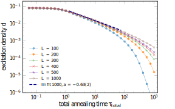
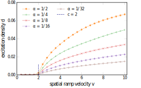
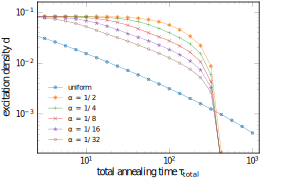

# 1D Transverse-Field Ising Model – Exact Simulation via Free Fermions

This repository contains a fast and accurate simulation of the **1D Ising model with a transverse field**, exploiting **Jordan-Wigner transformation** to free fermions.

---

## Documentation [Open on GitHub](./docs/documentation.ipynb)

---

## Model Overview

The Hamiltonian of the system is:

$$
H = -\sum_{n=1}^{L-1} \sigma^z_n \sigma^z_{n+1} - \sum_{n=1}^{L} g_n \sigma^x_n
$$

- $L$: Number of spin-1/2 sites  
- $g_n$: Transverse magnetic field (can be time-dependent or spatially varying)  
- $\sigma^x_n, \sigma^z_n$: Pauli matrices acting on site $n$

---

## Methods

Exponential growth of the Hilbert space with the number of particles makes exact diagonalization methods inefficient to simulate a system of as few as $50$ particles. \
However, this model can be mapped to a system of non-interacting spinless fermions using the **Jordan-Wigner transformation**:

$$
\sigma^x_n = 1 - 2 c^{\dagger}_n c_n,
$$
$$
\sigma^z_n = -(c_n + c^{\dagger}_n) \prod (1 - 2 c^{\dagger}_m c_m)
$$

resulting in a quadratic form that can be diagonalized via the **Bogoliubov transformation**.\
This approach allows us to work with $2L \times 2L$ matrices, instead of $2^L \times 2^L$ ones. 

---

## Features

- Efficient method of simulating quantum quenches in 1D Ising model, can be used for systems with even up to 2500 particles
- Time evolution is done by integrating Time-dependent Bogoliubov-de-Gennes equations
- Kibble-Zurek scaling analysis
- Supports both uniform and space-dependent fields $g_n(t)$

---

## Contents

- `src/ising_model/ising_model.py`: Core simulation engine
- `docs/documentation.ipynb`: Full documentation and theoretical background
- `tests/`: Includes the Kibble-Zurek power-law test and comparisons between uniform and inhomogeneous quenches
- `plots/`: Plots generated by the test scripts

---

<h2>KZ power-law test</h2>

Transverse field $g$ is changed from $g=2$ to $g=1$ in time $\tau_Q$:

$$g(t) =
\begin{cases}
2, & \text{if } \frac{t}{\tau_Q} < -\frac{\pi}{2} \\
3/2 - 1/2 \sin(\frac{t}{\tau_Q}), & \text{if } -\frac{\pi}{2} \leq \frac{t}{\tau_Q} \leq \frac{\pi}{2} \\
1, & \text{if } \frac{t}{\tau_Q} > \frac{\pi}{2}
\end{cases}$$

Density of excitations is predicted to scale as:

$$d \sim \tau_Q^{-2/3}$$

  

<h2>Spatially dependent ramp</h2>

  

  

<h2>Inhomogeneous vs uniform quench</h2>

  

---

## License

MIT License — free to use, cite, and modify. Feel free to build on it!

---

## References

- [1] Jacek Dziarmaga, Dynamics of a Quantum Phase Transition: Exact Solution of the Quantum Ising Model, Phys. Rev. Lett. 95, 245701 (2005)
- [2] Jacek Dziarmaga, Marek M. Rams, Dynamics of an inhomogeneous quantum phase transition, New J. Phys. 12 055007 (2010)